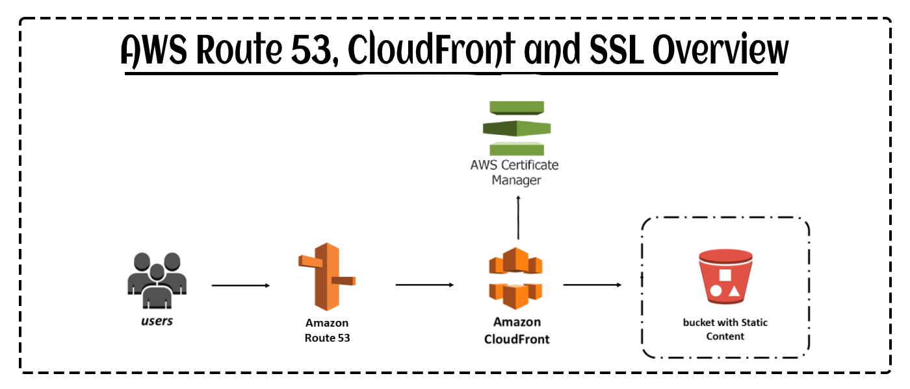
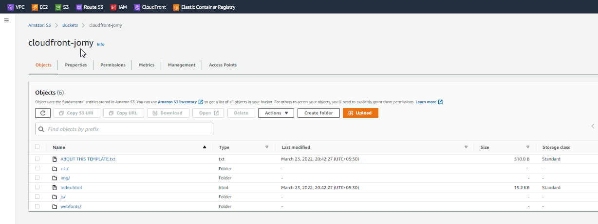
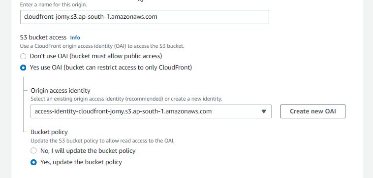
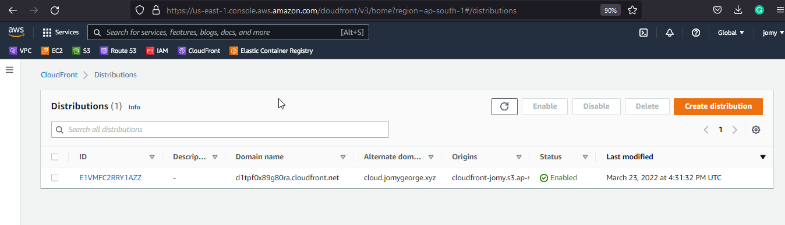
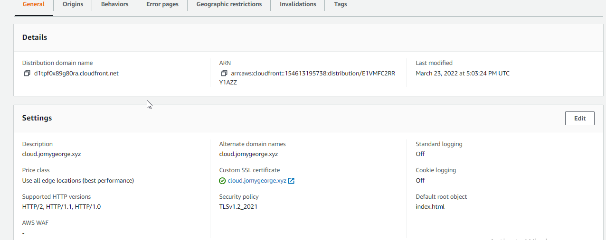
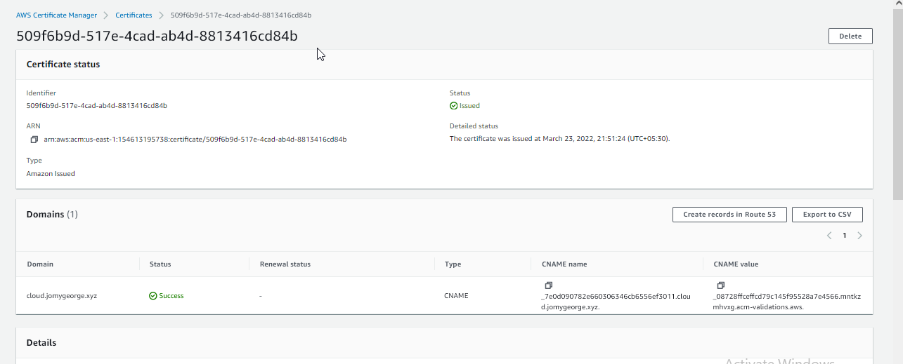
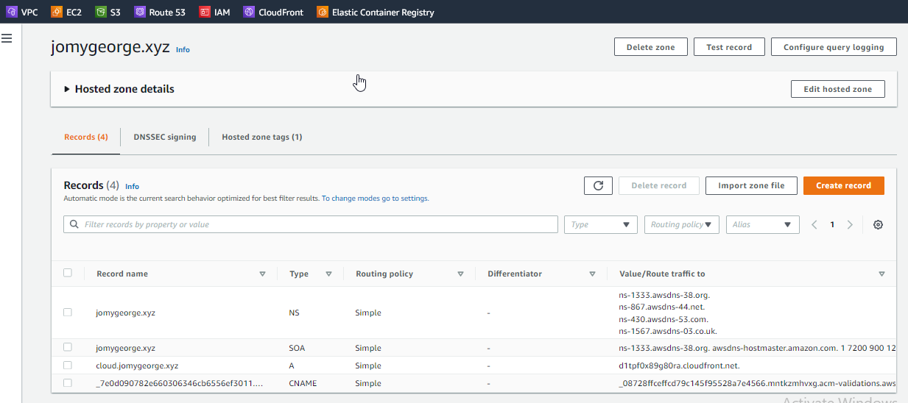
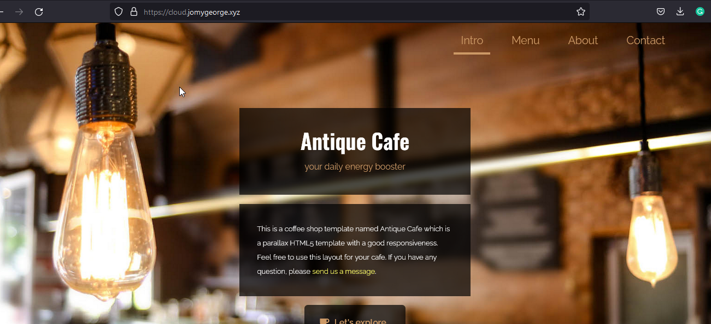

Setting-Cloudfront-for-s3-as origin

[](https://travis-ci.org/joemccann/dillinger)

## Description

Amazon CloudFront is a global content delivery network (CDN) service built for high-speed, low-latency performance, security, and developer ease-of-use. We can set Cloudfront to different origins as Ec2 instance, S3 bucket.
Amazon CloudFront is a content delivery network operated by Amazon Web Services. Content delivery networks provide a globally-distributed network of proxy servers that cache content, such as web videos or other bulky media, more locally to consumers, thus improving access speed for downloading the content.

<center> </img></center>

## Pre-Requests
```
S3 Bucket with static site enabled
ROute 53
ACM - For ssl
CLoudfront with OAI Enabled
```

#### OAI : origin access identity

The request to create a new origin access identity (OAI). An origin access identity is a special CloudFront user that you can associate with Amazon S3 origins, so that you can secure all or just some of your Amazon S3 content.

### Lets go to the deployment:
#### Step 1 Create S3 bucket
```
Create a S3 Bucket with default settings and only enable the static website host.
Upload your site contents to your s3 bucket and save it
```
<center> </img></center>


Step 2 : Create Cloudfront

```
* Select your S3 bucket on cloudfront "orgin domain" 
* On Viewer protocol policy, slect the HTTP to HTTPS Redirect.
* On Settings, you can choose the edge locations
* At Alternate domain name (CNAME), provide a name called like "cloud.jomygeorge.xyz"
* Finaly create a ACM SSL, Associate a certificate from AWS Certificate Manager. The certificate must be in the US East (N. Virginia) Region (us-east-1). For this     you can request on time and add its records to ROute 53 for the verifications. 
* Default root object : index.html in my case
```

<center> </img></center>
<center> </img></center>
<center> </img></center>
<center> </img></center>

Step 2 : On ROute 53
```
* Create a A record for the subdomain "cloud.jomygeorge.xyz" 
* Then Route traffic to as alias "Alias to cloudfront distrubution" and slect you cloudfront ID
* Create the record now
```
<center> </img></center>

## Conclusion

In this tutorial we discussed how to set a cloudfront for an S3 origin. The goal is to get you started on using Amazon CloudFront for for high-speed, low-latency performance, security, and developer ease-of-use as it is cheap and easy to do.

<center> </img></center>

#### ⚙️ Connect with Me

<p align="center">
<a href="mailto:jomyambattil@gmail.com"></a>
<a href="https://www.linkedin.com/in/jomygeorge11"></a> 
<a href="https://www.instagram.com/therealjomy"></a><br />
